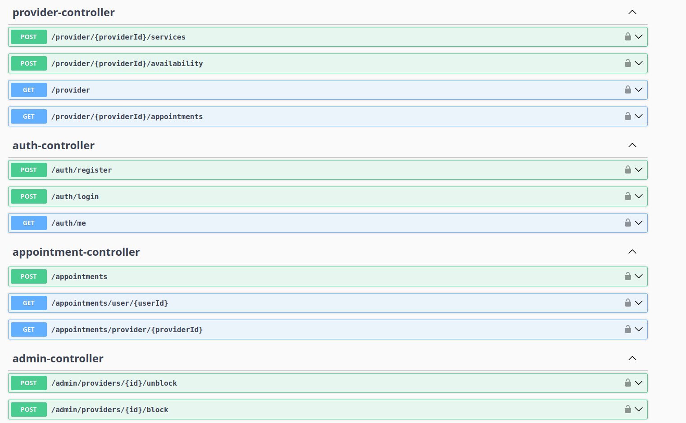

# System Rezerwacji Usług – Backend (Spring Boot + JWT + Swagger)

Aplikacja backendowa umożliwiająca rezerwację usług pomiędzy użytkownikami a providerami. System zawiera pełną obsługę logowania i rejestracji, zarządzanie usługami, dostępnością, rezerwacjami oraz panel administratora. Autoryzacja oparta jest o JWT, a dokumentacja API dostępna jest w Swagger UI.

---

## 📌 Funkcjonalności

### 🔐 Autoryzacja i użytkownicy

- Rejestracja użytkownika  
- Logowanie z generowaniem tokenu JWT  
- Pobieranie danych aktualnie zalogowanego użytkownika (`/auth/me`)  

**Role:**

- `USER` – może rezerwować usługi  
- `PROVIDER` – może dodawać usługi, dostępność i zarządzać rezerwacjami  
- `ADMIN` – pełna administracja systemem  
- `BLOCKED` – brak dostępu  

---

### 🧑‍⚕️ Provider

- Dodawanie usług  
- Dodawanie dostępności  
- Podgląd swoich rezerwacji  

---

### 📅 Rezerwacje

- Tworzenie rezerwacji  
- Walidacja konfliktów czasowych  
- Pobieranie rezerwacji użytkownika i providera  

---

### 🛠️ Administrator

- Zarządzanie providerami (blokowanie, odblokowywanie, usuwanie)  
- Podgląd wszystkich rezerwacji  
- Usuwanie rezerwacji  

---

## 🧱 Technologie

- Java 17  
- Spring Boot 3  
- Spring Security + JWT  
- Spring Data JPA  
- Hibernate  
- Lombok  
- Swagger / OpenAPI  

---

## 🚀 Uruchamianie lokalne

### 1. Zbudowanie projektu

```bash
mvn clean package -DskipTests
```

### 2. Uruchomienie aplikacji

```bash
java -jar target/projekt-0.0.1-SNAPSHOT.jar
```

Aplikacja wystartuje pod adresem:

```
http://localhost:8080
```

---

## 📘 Dokumentacja API (Swagger)

Swagger UI dostępny jest pod:

```
http://localhost:8080/swagger-ui.html
```

lub

```
http://localhost:8080/swagger-ui/index.html
```

---

## 🧩 Architektura systemu

```
                       ┌──────────────────────────┐
                       │        Klient (UI)       │
                       │  React / Angular / Swagger│
                       └──────────────┬───────────┘
                                      │ HTTP/JSON
                                      ▼
                        ┌────────────────────────┐
                        │     Spring Boot API    │
                        │  (Controllers Layer)   │
                        └──────────────┬─────────┘
                                       │
                                       ▼
                        ┌────────────────────────┐
                        │     Service Layer      │
                        │  Logika biznesowa      │
                        └──────────────┬─────────┘
                                       │
                                       ▼
                        ┌────────────────────────┐
                        │   Repository Layer     │
                        │  Spring Data JPA       │
                        └──────────────┬─────────┘
                                       │
                                       ▼
                        ┌────────────────────────┐
                        │       Database         │
                        │   PostgreSQL / H2      │
                        └────────────────────────┘
```

---

## 🔐 JWT Authentication Flow

```
1. Klient wysyła login + hasło → POST /auth/login
2. Backend generuje JWT (email jako subject)
3. Klient wysyła token w nagłówku: Authorization: Bearer <TOKEN>
4. JwtAuthenticationFilter weryfikuje token
5. SecurityContext ustawia użytkownika jako zalogowanego
6. Kontrolery obsługują żądania zgodnie z rolą użytkownika
```

---

## 📌 Przykładowe requesty

### 🔐 Rejestracja

```http
POST /auth/register
Content-Type: application/json

{
  "email": "user@example.com",
  "password": "password123",
  "name": "User One",
  "role": "USER"
}
```

---

### 🔐 Logowanie

```http
POST /auth/login
Content-Type: application/json

{
  "login": "user@example.com",
  "password": "password123"
}
```

### 🔐 Odpowiedź

```json
{
  "token": "JWT_TOKEN_HERE"
}
```

---

### 🔐 Pobranie danych użytkownika

```http
GET /auth/me
Authorization: Bearer JWT_TOKEN
```

---

### 🧑‍⚕️ Provider – dodanie usługi

```http
POST /provider/5/services
Authorization: Bearer JWT_TOKEN
Content-Type: application/json

{
  "name": "Masaż klasyczny",
  "description": "60 minut",
  "price": 150.0
}
```

---

### 🧑‍⚕️ Provider – dodanie dostępności

```http
POST /provider/5/availability
Authorization: Bearer JWT_TOKEN
Content-Type: application/json

{
  "startTime": "2025-02-10T10:00:00",
  "endTime": "2025-02-10T12:00:00"
}
```

---

### 📅 Rezerwacje – utworzenie rezerwacji

```http
POST /appointments
Authorization: Bearer JWT_TOKEN
Content-Type: application/json

{
  "serviceId": 3,
  "providerId": 5,
  "userId": 1,
  "startTime": "2025-02-10T10:00:00",
  "endTime": "2025-02-10T11:00:00"
}
```

---

### 🛠️ Admin – blokowanie providera

```http
POST /admin/providers/5/block
Authorization: Bearer JWT_TOKEN
```

---

## 🗄️ Struktura bazy danych (ERD)

### User

- id  
- username  
- email  
- password  
- role  

### ServiceEntity

- id  
- name  
- description  
- price  
- provider_id  

### Availability

- id  
- startTime  
- endTime  
- provider_id  

### Appointment

- id  
- startTime  
- endTime  
- user_id  
- provider_id  
- service_id  

---

## 📸 Podgląd API (Swagger UI)


## Swagger UI



